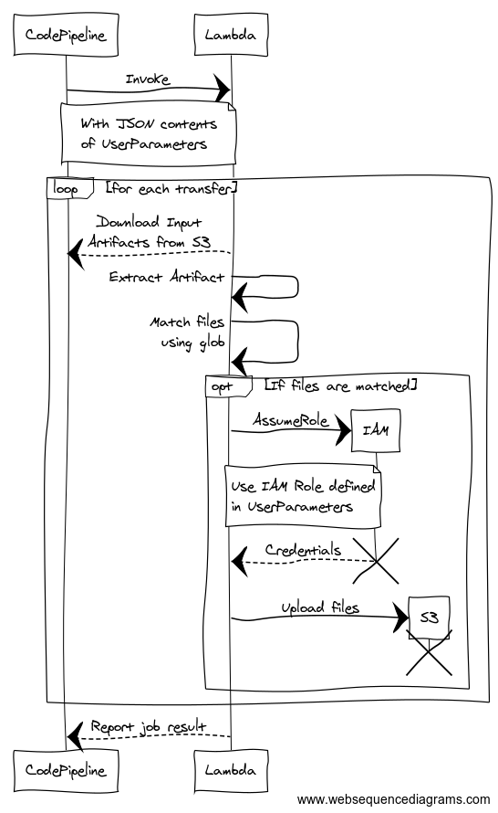

# CodePipeline S3 File Transfer Action

[](https://snyk.io/test/github/davidkelley/aws-pipeline-transfer?targetFile=package.json) [](https://doc.esdoc.org/github.com/davidkelley/aws-pipeline-transfer) [](https://codecov.io/gh/davidkelley/aws-pipeline-transfer) [](https://circleci.com/gh/davidkelley/aws-pipeline-transfer/tree/master) [](https://greenkeeper.io/)

[](https://conventionalcommits.org/) [](https://github.com/semantic-release/semantic-release)

This project enables a custom CodePipeline action that allows you to specify files from pipeline artifacts, to be transferred to S3 buckets (see example below). Each transfer must contain a destination bucket, an optional key prefix to apply to all transfers and a source (`src`) key, which defines in a glob fashion the files to be uploaded.

**The role provided to each transfer enables fine-grained access control, as the deployed function does not have sufficient permissions. Sample IAM policies are detailed below.**

## How does it work?

The following sequence diagram depicts the flow of actions that happen when CodePipeline invokes this lambda function, with a valid `UserParameters` payload:



In-order to ensure your Pipeline has necessary permissions to invoke a Lambda function, follow the [setup steps here](http://docs.aws.amazon.com/codepipeline/latest/userguide/actions-invoke-lambda-function.html).

An example action definition inside a CodePipeline CloudFormation resource definition:

```yaml
- Name: Transfer
  Actions:
    - Name: S3
      RunOrder: 1
      InputArtifacts:
        - Name: BuildOutput
        - Name: DeployOutput
      ActionTypeId:
        Category: Invoke
        Owner: AWS
        Version: 1
        Provider: Lambda
      Configuration:
        FunctionName: !ImportValue TransferFunctionName
        UserParameters: !Sub |
          [
            {
              "roleArn": {
                "Fn::GetParam": ["DeployOutput", "Outputs.json", "AssetS3BucketTransferRole"]
              },
              "bucket": {
                "Fn::GetParam": ["DeployOutput", "Outputs.json", "AssetS3Bucket"]
              },
              "prefix": "s3/key/prefix/",
              "cwd": "compiled/",
              "src": [
                "BuildOutput::*.js"
              ]
            },
            {
              "roleArn": "arn:aws:iam::123456789012:role/image-s3-bucket-permissions",
              "bucket": "pre-created-s3-bucket",
              "prefix": "s3/images/prefix/",
              "src": [
                "BuildOutput::images/*"
              ]
            }
          ]
```

An example IAM policy for granting the Transfer function permissions to your assets bucket:

```yaml
AssetS3BucketTransferRole:
  Type: AWS::IAM::Role
  Properties:
    Path: !Sub "/${Name}/"
    AssumeRolePolicyDocument:
      Version: "2012-10-17"
      Statement:
        - Effect: Allow
          Principal:
            AWS: !ImportValue TransferFunctionRoleArn
          Condition:
            StringEquals:
              sts:ExternalId: !ImportValue TransferFunction
          Action: sts:AssumeRole
    Policies:
      - PolicyName: UploadAssetsPermission
        PolicyDocument:
          Version: 2012-10-17
          Statement:
            - Effect: Allow
              Action:
                - s3:PutObject
              Resource:
                - !Sub "${AssetS3Bucket}/*"
```

For a full definition of what you can define inside the `UserParameters` key, see [the JSON Schema file](/functions/transfer/transfer/validate/schema.js).
